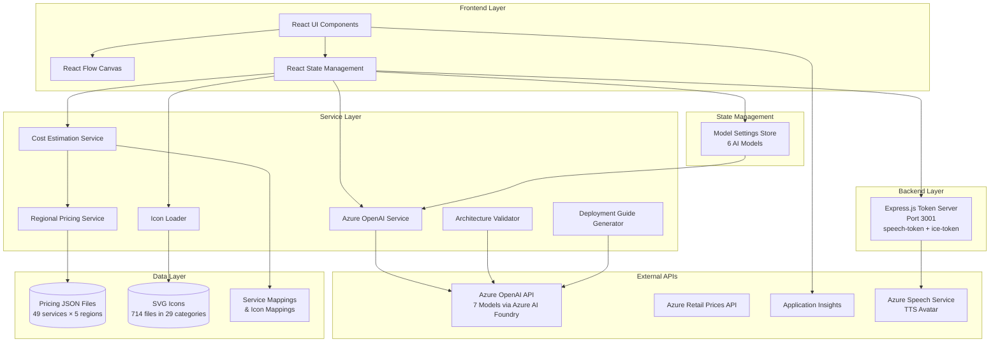
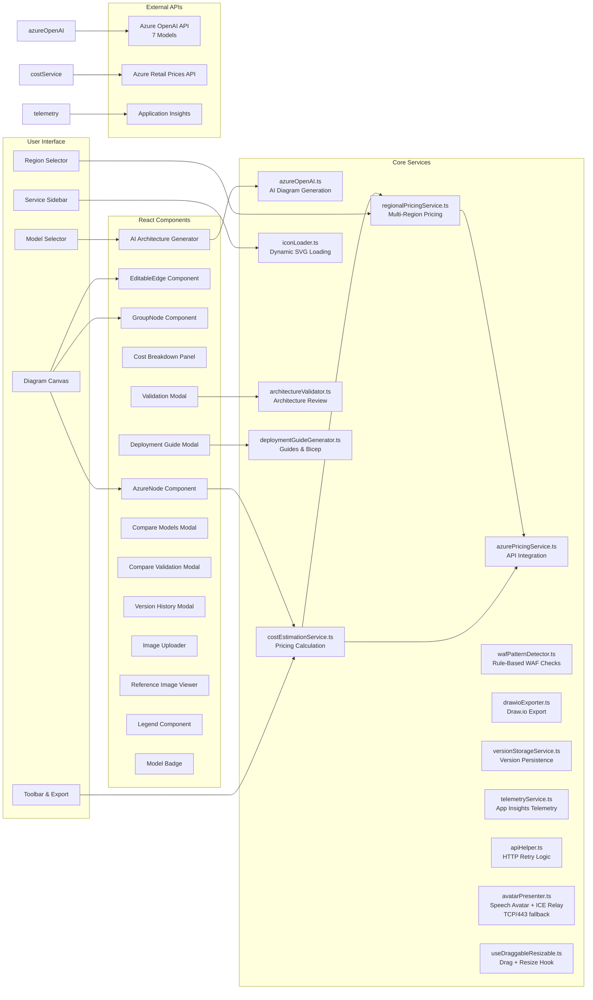
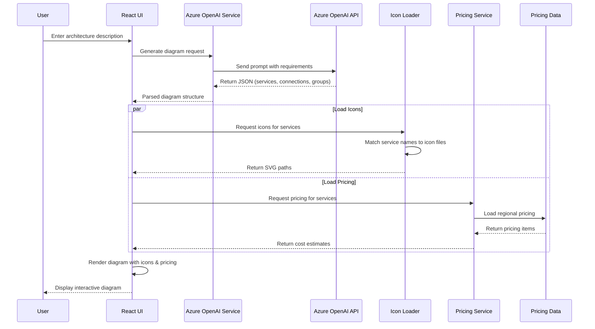
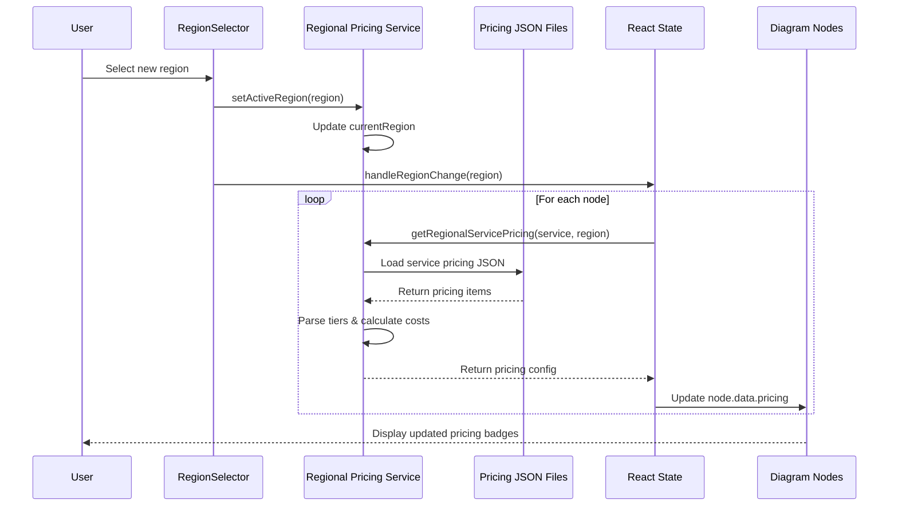
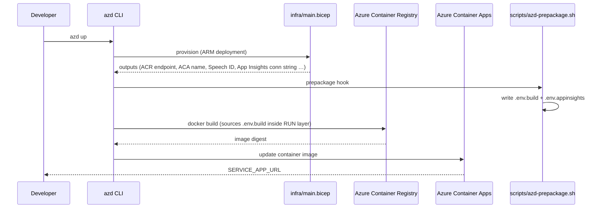

# Azure Architecture Diagram Builder - System Architecture

**Last Updated**: March 14, 2026 (azd template + CI/CD pipeline)

## Overview

The Azure Architecture Diagram Builder is a web-based tool that uses AI to generate Azure architecture diagrams with real-time pricing estimates. Built with React, TypeScript, and Vite, it leverages **7 AI models** via Azure OpenAI: **GPT-5.1, GPT-5.2, GPT-5.2 Codex, GPT-5.3 Codex, GPT-5.4, DeepSeek V3.2 Speciale, and Grok 4.1 Fast** for intelligent diagram generation, validation, and Infrastructure as Code generation. The Azure Retail Prices API provides cost estimation across 5 regions. A lightweight Express.js **token server** (port 3001) runs co-located with nginx inside the container, handling keyless Azure Speech authentication for the **Talking Avatar Presenter** feature via `DefaultAzureCredential` (Managed Identity). The app is deployed on Azure Container Apps and instrumented with Application Insights for telemetry.

## High-Level Architecture



## Detailed Component Architecture



## Data Flow - Diagram Generation



## Data Flow - Region Change



## File Structure

```text
azure-diagrams/
├── src/
│   ├── components/                    # React UI components (21 components)
│   │   ├── AIArchitectureGenerator.tsx # AI generation modal with model selection (395 lines)
│   │   ├── AlignmentToolbar.tsx       # Node alignment tools (106 lines)
│   │   ├── AzureNode.tsx              # Service node with pricing badge (263 lines)
│   │   ├── CompareModelsModal.tsx     # Multi-model architecture comparison (644 lines)
│   │   ├── CompareValidationModal.tsx # Multi-model WAF validation comparison (617 lines)
│   │   ├── DeploymentGuideModal.tsx   # Deployment guide & Bicep output (341 lines)
│   │   ├── EditableEdge.tsx           # Connection lines with labels (228 lines)
│   │   ├── GroupNode.tsx              # Container groups with color picker (210 lines)
│   │   ├── IconPalette.tsx            # Drag-and-drop icon palette (198 lines)
│   │   ├── ImageUploader.tsx          # Image upload & vision analysis (186 lines)
│   │   ├── Legend.tsx                 # Diagram legend, collapsible (197 lines)
│   │   ├── ModelBadge.tsx             # AI model attribution overlay (71 lines)
│   │   ├── ModelSelector.tsx          # Model/reasoning dropdown (351 lines)
│   │   ├── ModelSettingsPopover.tsx   # Per-feature model overrides (264 lines)
│   │   ├── ReferenceImageViewer.tsx   # Floating image comparison overlay (73 lines)
│   │   ├── RegionSelector.tsx         # Region picker with flags (69 lines)
│   │   ├── SaveSnapshotModal.tsx      # Save snapshots (121 lines)
│   │   ├── TitleBlock.tsx             # Architecture title block (156 lines)
│   │   ├── ValidationModal.tsx        # WAF validation UI (345 lines)
│   │   ├── VersionHistoryModal.tsx    # Version comparison & restore (272 lines)
│   │   └── WorkflowPanel.tsx          # Workflow steps with hover highlighting (77 lines)
│   │
│   ├── services/                      # Business logic layer (12 files)
│   │   ├── apiHelper.ts               # HTTP retry logic (102 lines)
│   │   ├── architectureValidator.ts   # Architecture review & validation (430 lines)
│   │   ├── azureOpenAI.ts             # AI diagram generation (925 lines)
│   │   ├── azurePricingService.ts     # Azure API integration (145 lines)
│   │   ├── costEstimationService.ts   # Pricing calculations (404 lines)
│   │   ├── deploymentGuideGenerator.ts # Deployment guides & Bicep (412 lines)
│   │   ├── drawioExporter.ts          # Draw.io XML export (417 lines)
│   │   ├── localPricingService.ts     # Local pricing fallback (76 lines)
│   │   ├── regionalPricingService.ts  # Multi-region pricing (356 lines)
│   │   ├── telemetryService.ts        # Application Insights integration (277 lines)
│   │   ├── versionStorageService.ts   # Version history persistence (180 lines)
│   │   └── wafPatternDetector.ts      # Rule-based WAF pattern checks (394 lines)
│   │
│   ├── stores/                        # State management
│   │   └── modelSettingsStore.ts      # Multi-model settings with localStorage (303 lines)
│   │
│   ├── data/
│   │   ├── pricing/
│   │   │   └── regions/
│   │   │       ├── eastus2/           # 49 JSON files
│   │   │       ├── swedencentral/     # 49 JSON files
│   │   │       ├── westeurope/        # 49 JSON files
│   │   │       ├── brazilsouth/       # 49 JSON files
│   │   │       └── canadacentral/     # 49 JSON files
│   │   ├── azurePricing.ts            # Service mappings & fallback pricing (1,163 lines)
│   │   └── serviceIconMapping.ts      # AI name → icon path mapping (945 lines)
│   │
│   ├── utils/
│   │   ├── iconLoader.ts              # Icon matching & loading (116 lines)
│   │   ├── layoutEngine.ts            # Auto-layout algorithm (384 lines)
│   │   ├── layoutPresets.ts           # Layout preset configurations (477 lines)
│   │   ├── modelNaming.ts             # Model display name utilities (111 lines)
│   │   └── pricingHelpers.ts          # Currency formatting (333 lines)
│   │
│   ├── types/
│   │   └── pricing.ts                 # TypeScript interfaces
│   │
│   └── App.tsx                        # Main application (3,000 lines)
│
├── server/                            # Express.js backend (port 8787)
│   ├── index.js                       # Server entry point
│   └── store.js                       # Data persistence
│
├── Azure_Public_Service_Icons/        # 714 SVG files in 29 categories
├── infra/                             # Bicep infrastructure (azd template)
│   ├── main.bicep                     # Subscription-scoped entry; creates RG, emits outputs
│   ├── resources.bicep                # All Azure resources (ACR, ACA, Log Analytics, Speech, Cosmos)
│   ├── main.parameters.json           # Parameter defaults with azd ${ENV} tokens
│   └── abbreviations.json             # Azure resource naming conventions
├── .github/
│   └── workflows/
│       ├── azure-dev.yml              # azd CI/CD: provision + deploy on push to main
│       └── validate-azd.yml           # Gallery standard validation (Azure-Samples submission)
├── azure.yaml                         # azd config: service declaration + prepackage hook
├── scripts/                           # Utility & deployment scripts
│   ├── azd-prepackage.sh              # azd hook: writes .env.build + .env.appinsights before docker build
│   ├── fetch-multi-region-pricing.sh  # Download pricing data
│   ├── download-pricing.js            # Node.js pricing fetcher
│   ├── rename-icons.sh                # Icon file management
│   ├── deploy.sh                      # Local deployment
│   ├── deploy_aca.sh                  # ACA initial deployment (manual)
│   └── update_aca.sh                  # ACA build & update (ACR + Container App, manual)
├── DOCS/                              # Documentation
│   ├── ARCHITECTURE.md                # This file
│   └── getting-started-guide.md       # Step-by-step feature walkthrough
├── Dockerfile                         # Multi-stage container build (Node 20 + nginx)
└── nginx.conf                         # Production serving
```

## Key Technologies

### Frontend Stack
- **React 18.2** - UI framework
- **TypeScript 5.2** - Type safety
- **Vite 5.0** - Build tool & dev server (port 3000)
- **React Flow 11.10.4** - Interactive diagram canvas
- **html2canvas 1.4.1** - Diagram export to PNG

### Backend Stack
- **Express.js** - Server on port 8787
- **Node.js** - Runtime for server and scripts

### AI Models (via Azure AI Foundry)
- **GPT-5.1** - Reasoning model with configurable effort (none/low/medium/high)
- **GPT-5.2** - Reasoning model with configurable effort (none/low/medium/high)
- **GPT-5.2 Codex** - Code-optimized reasoning model
- **GPT-5.3 Codex** - Latest code-optimized reasoning model
- **GPT-5.4** - Most capable frontier model for professional work, coding, and tool use
- **DeepSeek V3.2 Speciale** - Third-party model via Azure AI Foundry
- **Grok 4.1 Fast** - Third-party model via Azure AI Foundry
- Selectable per-generation via **ModelSelector** dropdown
- Per-feature overrides (generation, validation, deployment) stored in localStorage

### Services & APIs
- **Azure OpenAI API** (`2025-04-01-preview`) - AI-powered diagram generation, validation, deployment guides
- **Azure Retail Prices API** - Real-time pricing data
- **Application Insights** - Telemetry, feature usage tracking, session analytics
- **Vite Dynamic Imports** - SVG icon loading (`import.meta.glob`)

### Data Management
- **JSON files** - Cached regional pricing (245 files total: 49 services × 5 regions)
- **SVG files** - Azure service icons (714 files)
- **In-memory caching** - Performance optimization
- **localStorage** - Model settings, per-feature overrides, version history, export history

### Deployment
- **Azure Container Apps** - Production hosting (min 1, max 3 replicas)
- **Azure Container Registry** - Image storage; built by azd or `az acr build`
- **Azure Developer CLI (azd)** - One-command provision + deploy via `infra/` Bicep
- **GitHub Actions** - CI/CD pipeline (`.github/workflows/azure-dev.yml`) on push to `main`
- **nginx** - Static file serving in production container
- **Dockerfile** - Multi-stage build (Node 20 Alpine + nginx)

## Core Features

### 1. AI-Powered Diagram Generation
- **Input**: Natural language architecture description, or uploaded image, or IaC template (ARM/Bicep/Terraform)
- **Model Selection**: Choose from 7 models (GPT-5.1, GPT-5.2, GPT-5.2 Codex, GPT-5.3 Codex, GPT-5.4, DeepSeek V3.2 Speciale, Grok 4.1 Fast) with optional reasoning effort
- **Processing**: Azure OpenAI analyzes requirements and generates structured JSON
- **Post-processing**: Service names normalized against `serviceIconMapping`, categories corrected, icons resolved
- **Output**: Services, connections (sync/async/optional/bidirectional), groups, and workflow steps
- **13 curated sample prompts** spanning 7 categories (Web, Security, AI, E-commerce, Healthcare, Data & Analytics, IoT)
- **Model Override**: Settings captured at click time from `useModelSettings()` hook and passed explicitly to API

### 2. Icon Matching System
- **Challenge**: Map AI-generated service names to 714 icon files
- **Solution**: Two-path resolution system
  - **Path 1 (Direct)**: `getServiceIconMapping()` matches service name or aliases against 68 mapped services with exact icon file paths and categories
  - **Path 2 (Fuzzy fallback)**: Loads all icons from a category and applies multi-stage matching: exact → multi-word → primary word → first icon in category
  - Service icon mapping file (945 lines) maps AI names directly to icon paths, pricing flags, and display names
  - Service name normalization mappings (1,163 lines)
  - Title Case conversion with acronym preservation (AI, SQL, CDN, API, etc.)

### 3. Regional Pricing Engine
- **5 regions supported**: East US 2, Sweden Central, West Europe, Brazil South, Canada Central
- **49 services per region**: 245 total pricing files
- **Dynamic loading**: Pricing fetched on-demand per service/region
- **Caching**: Two-level cache (raw data + parsed pricing)
- **Fallback system**: Usage-based services use estimated costs

### 4. Cost Estimation
- **Real-time calculation**: Updates on region change
- **Tier-based pricing**: Multiple SKUs per service (Basic, Standard, Premium)
- **Monthly estimates**: Converts hourly/usage-based to monthly
- **Cost breakdown**: Total, per-group, per-service analysis
- **Color-coded badges**:
  - Green: Free or < $100/month
  - Yellow: $100-500/month
  - Orange: $500-1000/month
  - Red: > $1000/month

### 5. Export Capabilities
- **PNG Export**: High-quality 2x scale diagram images
- **SVG Export**: Vector graphics for editing
- **JSON Export**: Diagram structure for re-import
- **Draw.io Export**: XML format for Draw.io/diagrams.net editing
- **ARM Template**: Azure deployment ready (partial)
- **CSV/JSON Cost Reports**: Detailed cost breakdowns

### 6. Architecture Validation
- **Hybrid approach**: Rule-based WAF pattern detection (65+ rules in `wafPatternDetector.ts`) + AI-powered contextual refinement
- **Five WAF pillars**: Security, Reliability, Performance Efficiency, Cost Optimization, Operational Excellence
- **Output**: Overall score (0-100), per-pillar scores, severity-classified findings, quick wins
- **Apply recommendations**: Select findings and regenerate an improved architecture automatically
- **Download report**: Markdown report with embedded diagram snapshot (PNG)
- **Dismiss hint**: During analysis, users see a message confirming they can close the panel and return via the Validation Score button

### 7. Deployment Guide Generation
- **Bicep templates**: Infrastructure-as-Code generation from diagrams
- **Step-by-step guides**: Deployment instructions per service
- **Prerequisites**: Lists required Azure permissions and tools

### 8. Version History
- **Auto-save**: Snapshots saved on significant changes
- **Manual save**: Named snapshots with descriptions
- **Comparison**: Side-by-side version diff
- **Restore**: Roll back to any previous version

### 9. Model Selection & Comparison
- **7 models**: GPT-5.1, GPT-5.2, GPT-5.2 Codex, GPT-5.3 Codex, GPT-5.4, DeepSeek V3.2 Speciale, Grok 4.1 Fast
- **Reasoning effort**: Configurable (none/low/medium/high) for reasoning-capable models
- **Per-feature overrides**: Different models for generation vs. validation vs. deployment guides
- **Architecture comparison**: Run the same prompt through multiple models in parallel; compare service counts, tokens, latency; apply the best result
- **Validation comparison**: Run WAF validation across models in parallel; compare scores, pillar breakdowns, severity distributions. An inline WAF info box describes the five pillars being assessed before the run starts
- **Export**: Save all diagrams as individual JSON files or a combined comparison report

### 10. IaC Template Import
- **Supported formats**: ARM templates (`.json`), Bicep (`.bicep`), Terraform (`.tf`), Terraform state (`.tfstate`)
- **Multi-file**: Select multiple files at once
- **AI analysis**: Parses resource definitions and dependencies to generate a visual diagram
- **Loading feedback**: Canvas banner shows "Parsing [format] Template..." during import

### 11. Application Insights Telemetry
- **Auto-tracking**: Page views, session duration, unique users, geography
- **Feature usage events**: Architecture_Generated, Architecture_Validated, DeploymentGuide_Generated, Diagram_Exported, ARM_Template_Imported, Image_Imported, Models_Compared, Recommendations_Applied, Version_Operation, Region_Changed, Start_Fresh
- **Zero-impact when disabled**: All tracking calls are no-ops if `VITE_APPINSIGHTS_CONNECTION_STRING` is not set
- **Privacy-friendly**: No PII collected; anonymous user IDs via cookies

## Service Name Mapping Strategy

The app uses a three-layer mapping system to handle service name variations:

```typescript
// Layer 1: AI-generated name → Azure service name
'Api Management' → 'API Management'
'Azure Cosmos Db' → 'Azure Cosmos DB'

// Layer 2: Azure service name → Pricing file
'API Management' → 'api_management.json'
'Azure Cosmos DB' → 'azure_cosmos_db.json'

// Layer 3: Azure service name → Icon file
'API Management' → 'api-management.svg' → Title Case → 'API Management'
'Azure Cosmos DB' → 'azure-cosmos-db.svg' → Title Case → 'Azure Cosmos DB'
```

## Performance Optimizations

1. **Icon Preloading**: Loads all 714 icons on app mount (async)
2. **Pricing Cache**: Two-level cache (raw JSON + parsed tiers)
3. **Lazy Loading**: Pricing data fetched only for used services
4. **Parallel Processing**: Icons and pricing load simultaneously
5. **Debounced Updates**: Region changes trigger single batch update
6. **Vite HMR**: Fast refresh during development
7. **Model Settings Persistence**: localStorage avoids re-configuration between sessions
8. **HTTP Retry Logic**: `apiHelper.ts` provides retry with exponential backoff for API calls

## Regional Pricing Data

### Fetching Script
```bash
scripts/fetch-multi-region-pricing.sh
```
- Fetches from Azure Retail Prices API
- Filters by region and service name
- Stores in `src/data/pricing/regions/{region}/{service}.json`
- 49 services × 5 regions = 245 files (~116KB each)

### Pricing Data Structure
```json
{
  "BillingCurrency": "USD",
  "Items": [
    {
      "serviceName": "API Management",
      "skuName": "Developer",
      "armRegionName": "eastus2",
      "retailPrice": 0.0616,
      "unitOfMeasure": "1 Hour",
      "type": "Consumption"
    }
  ]
}
```

## Critical Implementation Details

### Icon Matching Flow (App.tsx:1295-1400)
1. Try `getServiceIconMapping(service.name)` for direct match against aliases
2. Try `getServiceIconMapping(service.type)` as fallback
3. If mapping found: construct path from `mapping.category` + `mapping.iconFile`
4. If no mapping: load icons from category using `loadIconsFromCategory()`
5. Try exact name match (case-insensitive)
6. Try multi-word match (all significant words)
7. Try primary word match (first non-common word)
8. Use fallback icon from category
9. Cache icon path in `iconCache` Map

### Pricing Initialization (costEstimationService.ts:34-115)
1. Check if service has pricing data
2. Map AI name to Azure service name
3. Get default tier (Basic, Standard, Premium)
4. Fetch regional pricing from JSON files
5. Parse tiers and find best match
6. Calculate monthly cost from hourly/usage rates
7. Apply regional multiplier if needed
8. Return `NodePricingConfig` object

### AI Prompt Structure (azureOpenAI.ts:130-200)
- **Category mappings**: Guide AI to use correct categories
- **Critical icon mappings**: Exact service names that match icons
- **Rules**: 11 numbered rules for structure and naming
- **Examples**: Correct vs incorrect naming patterns
- **Service-specific guidance**: Microsoft Entra ID (not Azure AD)

## Environment Variables

> **Security note:** Azure OpenAI is proxied server-side via `server/token-server.js`
> (`/api/openai`). The API key is never embedded in the client bundle. The
> `VITE_AZURE_OPENAI_ENDPOINT` build-time value is a non-secret flag that tells
> the UI that AI is configured; the real endpoint and credentials are read at
> runtime by the token server.

```env
# Build-time variables (embedded by Vite via import.meta.env) — NON-SECRET.
# Deployment NAMES and the endpoint are safe to embed. The API key is NOT.
VITE_AZURE_OPENAI_ENDPOINT=<Azure OpenAI endpoint URL — non-secret flag>
VITE_AZURE_OPENAI_DEPLOYMENT=<Default deployment name>
VITE_AZURE_OPENAI_DEPLOYMENT_GPT51=<GPT-5.1 deployment>
VITE_AZURE_OPENAI_DEPLOYMENT_GPT52=<GPT-5.2 deployment>
VITE_AZURE_OPENAI_DEPLOYMENT_GPT52CODEX=<GPT-5.2 Codex deployment>
VITE_AZURE_OPENAI_DEPLOYMENT_GPT53CODEX=<GPT-5.3 Codex deployment>
VITE_AZURE_OPENAI_DEPLOYMENT_DEEPSEEK=<DeepSeek V3.2 Speciale deployment>
VITE_AZURE_OPENAI_DEPLOYMENT_GROK4FAST=<Grok 4.1 Fast deployment>
VITE_APPINSIGHTS_CONNECTION_STRING=<Application Insights connection string (optional)>
VITE_REASONING_EFFORT=<medium|low|high|none>

# Runtime variables (for server/container) — read by token-server.js
AZURE_OPENAI_ENDPOINT=<Azure OpenAI endpoint URL — REQUIRED for /api/openai>
AZURE_OPENAI_API_KEY=<Azure OpenAI key — OPTIONAL fallback; prefer managed identity>
LEARN_MCP_URL=<override for the Microsoft Learn MCP endpoint (optional)>
AZURE_COSMOS_ENDPOINT=<Cosmos DB endpoint>
COSMOS_DATABASE_ID=<Cosmos DB database ID>
COSMOS_CONTAINER_ID=<Cosmos DB container ID>
```

### Server-side endpoints (token-server.js)

| Endpoint | Purpose |
|----------|---------|
| `/api/speech-token` | Keyless AAD token for the Speech SDK (avatar) |
| `/api/ice-token` | WebRTC ICE relay credentials for avatar video |
| `/api/openai` | Proxies Azure OpenAI calls (managed identity, key fallback) |
| `/api/docs-search` | Microsoft Learn docs grounding for deployment guides |
| `/api/feedback` | Stores user feedback in Cosmos DB |

## Known Limitations

1. **Icon Coverage**: Not all Azure services have custom icons (fallbacks used for less common services)
2. **Pricing Accuracy**: Estimates based on default tiers and typical usage
3. **Usage-Based Services**: Fixed fallback estimates (e.g., Storage, Monitor)
4. **Region Coverage**: 5 regions (can expand to 60+ Azure regions)
5. **ARM Export**: Partial implementation, not production-ready
6. **Model Variability**: Third-party models (DeepSeek, Grok) may occasionally produce less precise service naming than GPT models

## Future Enhancements

1. **Custom Usage Estimates**: Allow users to input expected usage (GB, transactions, etc.)
2. **More Regions**: Expand to all Azure regions
3. **Real-time API Pricing**: Fetch latest prices on-demand (vs. cached)
4. **Cost Alerts**: Notify when estimated cost exceeds threshold
5. **Collaborative Editing**: Multi-user diagram editing
6. **Template Library**: Pre-built reference architectures

## Azure Developer CLI (azd) Template

The repo is structured as a fully compliant `azd` template, enabling one-command provisioning and deployment and qualifying it for the [Azure-Samples](https://github.com/Azure-Samples) gallery.

### How `azd up` works



### Provisioned resources

| Resource | SKU | Purpose |
|---|---|---|
| Azure Container Registry | Basic | Stores Docker image |
| Container Apps Environment | Consumption | Hosts the app |
| Azure Container App | 0.5 vCPU / 1 GiB | Runs nginx + token server |
| Log Analytics Workspace | PerGB2018, 30d | Container & app logs |
| Application Insights | workspace-based | Usage telemetry |
| Azure Speech (optional) | S0 | Avatar Presenter (keyless via RBAC) |
| Cosmos DB (optional) | Free tier | Diagram persistence |

### Managed Identity & RBAC

A **user-assigned managed identity** is created at provision time and assigned:

- `AcrPull` on the Container Registry — lets ACA pull images without admin credentials
- `Cognitive Services Speech User` on the Speech resource — keyless avatar auth via `DefaultAzureCredential`
- `Cosmos DB Built-in Data Contributor` on the Cosmos account — keyless diagram reads/writes (when enabled)

### Build-time vs runtime environment variables

Vite bakes `VITE_*` variables into the JS bundle at **build time**; they cannot be injected at runtime. Two files are written by the pre-package hook and sourced inside the Dockerfile `RUN` layer:

| File | Contents | Written by |
|---|---|---|
| `.env.build` | All `VITE_AZURE_OPENAI_*`, `VITE_SPEECH_REGION` | `scripts/azd-prepackage.sh` |
| `.env.appinsights` | `VITE_APPINSIGHTS_CONNECTION_STRING` | `scripts/azd-prepackage.sh` |

Both files are gitignored and never committed.

Runtime variables (`AZURE_SPEECH_REGION`, `AZURE_SPEECH_RESOURCE_ID`, `AZURE_COSMOS_ENDPOINT`, etc.) are set as Container App environment variables by Bicep.

### CI/CD (GitHub Actions)

`.github/workflows/azure-dev.yml` provisions and deploys on every push to `main`. Required GitHub secrets and variables:

| Name | Kind | Value |
|---|---|---|
| `AZURE_CLIENT_ID` | Secret | Federated credential client ID |
| `AZURE_TENANT_ID` | Secret | Entra ID tenant ID |
| `AZURE_SUBSCRIPTION_ID` | Secret | Azure subscription ID |
| `AZURE_OPENAI_ENDPOINT` | Secret | Azure OpenAI endpoint URL |
| `AZURE_OPENAI_API_KEY` | Secret | Azure OpenAI API key |
| `AZURE_ENV_NAME` | Variable | azd environment name (e.g. `prod`) |
| `AZURE_LOCATION` | Variable | Azure region (e.g. `eastus2`) |
| `AZURE_SPEECH_REGION` | Variable | Speech region (e.g. `westus2`) |
| `AZURE_OPENAI_DEPLOYMENT_NAME` | Variable | GPT-5.1 deployment name |

---

## Development Workflow

### Adding a New Service

1. **Fetch pricing data**:
   ```bash
   # Add to scripts/fetch-multi-region-pricing.sh
   SERVICES=("New Service Name")
   bash scripts/fetch-multi-region-pricing.sh
   ```

2. **Add service mapping** in `src/data/azurePricing.ts`:
   ```typescript
   SERVICE_NAME_MAPPING = {
     'New Service': 'Azure New Service',
   }
   DEFAULT_TIERS = {
     'Azure New Service': 'Standard',
   }
   FALLBACK_PRICING = {
     'Azure New Service': { standard: 10.00, ... },
   }
   ```

3. **Get/rename icon** in `Azure_Public_Service_Icons/`:
   - Find matching icon
   - Rename to `new-service.svg`
   - Place in appropriate category folder

4. **Test**:
   - Generate diagram with new service
   - Verify icon loads
   - Verify pricing badge appears

### Debugging Tips

1. **Icon not loading**: Check browser console for file path
2. **Pricing not showing**: Check `💰 Initializing pricing` logs
3. **Wrong pricing**: Verify service name mapping
4. **Vite cache issues**: `rm -rf node_modules/.vite && npm run dev`

## Conclusion

The Azure Architecture Diagram Builder demonstrates a sophisticated integration of AI, real-time pricing data, and dynamic UI rendering to create an intelligent architecture design tool. The modular architecture separates concerns effectively, enabling easy maintenance and feature additions.

Key architectural decisions:

- **7-model AI support** with reactive model selection via `useModelSettings()` hook and per-feature overrides
- **File-based pricing cache** for reliability and performance across 5 regions (245 pricing files)
- **Two-path icon resolution** for flexible service name handling (945-line mapping + 1,163-line normalization)
- **Layered service mappings** to bridge AI outputs with Azure reality
- **React Flow canvas** for professional diagram rendering with 21 custom components
- **Hybrid WAF validation** combining 65+ rule-based patterns with AI contextual analysis
- **Multi-model comparison** for architecture and validation side-by-side analysis
- **Talking Avatar Presenter** (`avatarPresenter.ts`) for narrated demos — draggable, resizable panel with WebRTC + Speech SDK, keyless auth via managed identity
- **`useDraggableResizable` hook** — pointer-capture drag + resize with viewport clamping, shared by both avatar panels
- **IaC template import** for ARM, Bicep, and Terraform files
- **Application Insights telemetry** for usage analytics and feature tracking
- **azd template** (`azure.yaml` + `infra/`) for one-command provision and deploy, qualifying for Azure-Samples gallery
- **Azure Container Apps deployment** with ACR builds and auto-scaling (1–3 replicas)

The system successfully handles the complexity of 714 icons, 245 pricing files, 7 AI models, and variable service naming conventions to deliver a seamless user experience.
