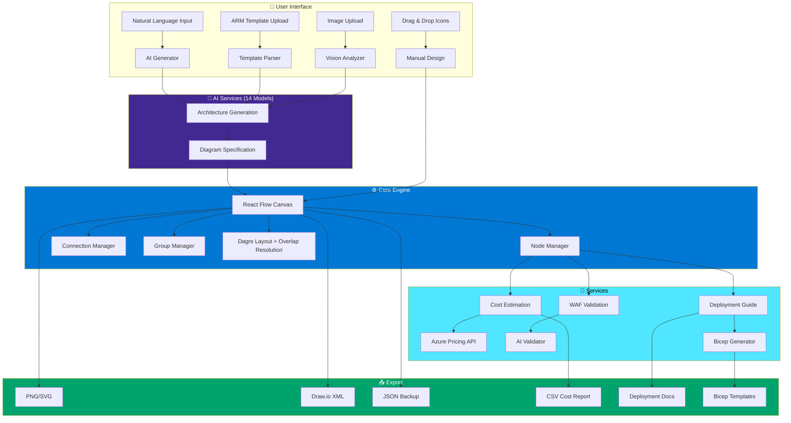
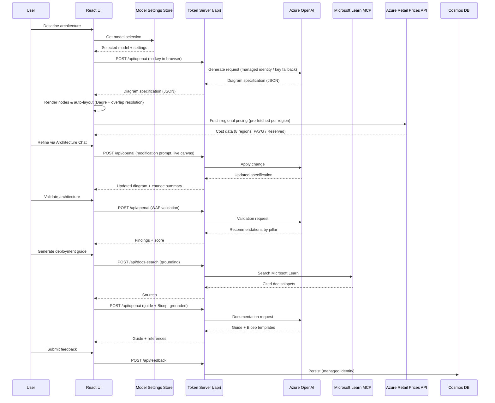
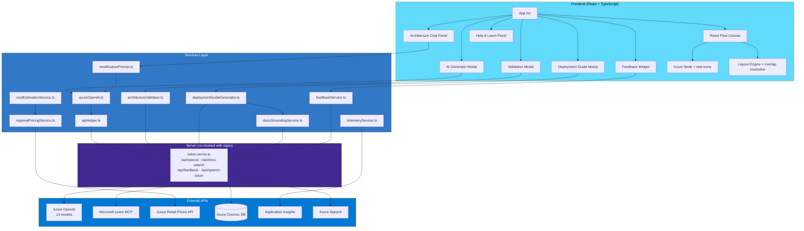

# Azure Architecture Diagram Builder

<div align="center">


**A professional AI-powered tool for designing, validating, and deploying Azure cloud architectures**

[Live Demo](https://azure-diagram-builder.yellowmushroom-f11e57c2.eastus2.azurecontainerapps.io) • [Short Link](https://aka.ms/diagram-builder) • [Documentation](DOCS/ARCHITECTURE.md) • [Report Bug](../../issues)

</div>

---

## 👤 Author

**Arturo Quiroga**  
*Senior Partner Solutions Architect (PSA) - Microsoft*

---

## 📖 Overview

Azure Architecture Diagram Builder is an enterprise-grade web application that empowers cloud architects to design, visualize, validate, and deploy Azure solutions. Leveraging **14 AI models** across multiple providers — **GPT-5.1, GPT-5.2, GPT-5.4, GPT-5.4 Mini, GPT-5.6 Sol, GPT-5.6 Terra, GPT-5.6 Luna, DeepSeek V3.2 Speciale, DeepSeek V4 Pro, Grok 4.1 Fast, Grok 4.3, Mistral Large 3, Kimi K2.5, and Kimi K2.7 Code** (via Azure OpenAI and Azure AI model deployments) — it transforms natural language descriptions into professional architecture diagrams while providing real-time cost estimates, Well-Architected Framework validation, multi-model comparison, and Infrastructure as Code generation.

Beyond editable **topology** diagrams, the app can also produce polished, whiteboard-style **Blueprint** diagrams (BETA) as shareable PNGs — ideal for presentations and design reviews.

### Why This Tool?

- **Speed**: Go from idea to deployable architecture in minutes, not hours
- **Accuracy**: Official Azure icons, real-time pricing from Azure Retail Prices API
- **Best Practices**: Built-in WAF validation ensures your architecture follows Microsoft recommendations
- **Actionable Output**: Generate deployment guides with Bicep/ARM templates ready for production

### 🎯 Scope & Intended Use

This tool is designed for **greenfield Azure** architecture design — sketching, validating, and
costing **new** solutions, and as an accelerator in architecture-design sessions and technical
workshops. It supports **Azure services only**.

The WAF validation produces a **diagram-only, design-time signal** intended to guide new designs.
It is **not** an audit of a deployed environment, and it is **not** intended for direct deployment
into existing, complex customer environments without further validation and review by a qualified
architect.

---

## ✨ Key Features

### 🤖 AI-Powered Architecture Generation
Describe your architecture in plain English and let any of **14 AI models** (GPT-5.1, GPT-5.2, GPT-5.4, GPT-5.4 Mini, GPT-5.6 Sol, GPT-5.6 Terra, GPT-5.6 Luna, DeepSeek V3.2 Speciale, DeepSeek V4 Pro, Grok 4.1 Fast, Grok 4.3, Mistral Large 3, Kimi K2.5, or Kimi K2.7 Code) automatically create a complete, professionally organized diagram with logical service groupings.

**13 curated example prompts** included — from simple web apps to complex enterprise scenarios:
- Zero Trust enterprise networks with security segmentation
- Healthcare HIPAA-compliant platforms with FHIR APIs
- Black Friday e-commerce handling 50K orders/hour
- Industrial IoT with 5,000+ sensors and predictive maintenance
- Global multiplayer gaming backends for 500K+ concurrent players
- AI-powered chatbots, document processing, content moderation
- And more...

### 🖼️ Architecture Image Import
Upload an existing architecture diagram image (screenshot, whiteboard photo, or exported PNG) and let AI analyze it to recreate the architecture as an editable, interactive diagram with proper Azure service mapping.

### 💬 Architecture Chat (Conversational Refinement)
Refine your diagram through a natural back-and-forth conversation instead of one-shot prompts. Click the **Chat** button in the toolbar to open a docked side panel where you can iterate in plain English:

- Type changes like *"add Azure Front Door with WAF"* → *"now make it zone-redundant"* → *"add a Redis cache between the API and the database"*
- Each turn reads the **live canvas** as the source of truth, so follow-up requests naturally build on previous ones
- The assistant replies with a concise summary of what changed (services added/removed)
- Every change is **auto-saved to version history**, so you can step back at any time
- Suggestion chips help you get started, and the panel shows which model is active

### ✏️ Blueprint Diagrams (BETA)
Generate a hand-drawn, **whiteboard-style blueprint** of your architecture — nested zones (Azure / VNet / On-prem) with numbered, labeled arrows that trace the end-to-end flow, just like an architect explaining a system at a whiteboard. Three generation modes are available in the AI Generator modal:

- **Topology** — the classic deployable, editable diagram on the canvas
- **Blueprint** *(BETA)* — a polished whiteboard-style PNG (the PNG is the deliverable; re-download any time via **Export > Export Blueprint PNG**)
- **Both** *(BETA)* — a deployable topology **and** a Blueprint PNG from the same prompt, optionally generated in parallel

> Blueprint and Both modes require a general-purpose OpenAI model (GPT-5.x). The app auto-switches if a third-party model is selected. A configurable legend position keeps the output presentation-ready.

### 📋 ARM Template Import
Import existing ARM templates and automatically visualize your current infrastructure. The AI parses resource dependencies and creates meaningful diagrams. A **glowing purple banner** provides visual feedback during parsing.

### 🎯 Well-Architected Framework Validation
Validate your architecture against all five WAF pillars:
- **Security** — Identity, encryption, network isolation
- **Reliability** — High availability, disaster recovery
- **Performance** — Scaling, caching, optimization
- **Cost Optimization** — Right-sizing, reserved instances
- **Operational Excellence** — Monitoring, automation

Select specific recommendations and automatically regenerate an improved architecture. During analysis, a dismiss hint lets you close the panel and return later via the **Validation Score** button in the toolbar.

### 🔀 Multi-Model Comparison
Compare AI output side-by-side across all 14 models:

- **Architecture Comparison** — Run the same prompt through multiple models and compare service counts, connection counts, groups, workflow steps, token usage, and latency
- **Validation Comparison** — Run WAF validation across models and compare overall scores, pillar-level scores, severity breakdowns, finding counts, and quick wins. An inline WAF info box explains the five pillars being assessed
- **Save All Diagrams** — Download each model's architecture as a separate JSON file
- **Save Comparison Report** — Download a combined JSON report for offline analysis
- **Present Critique** — Click "Present" to have a talking avatar narrate the AI ranking with live word-by-word closed captions (requires `VITE_SPEECH_REGION`)
- **Apply Winner** — Pick the best result and apply it to the canvas with one click

### 🎙️ Avatar Presenter
After completing a model comparison, use **Present Critique** to have a photorealistic talking avatar narrate the AI ranking results aloud — or click **Narrate** in the Workflow Panel to have the avatar walk through every architecture step:
- A 3D avatar appears in a **draggable, resizable** floating panel — grab the header to reposition anywhere on screen, drag the bottom-right corner to resize

### 🖼️ Draggable Reference Image Viewer
When a sketch or image is uploaded for AI generation, the reference image stays visible as a floating panel:
- **Drag** by the header bar to reposition anywhere on the canvas
- **Resize** by dragging the purple corner handle — scales from 160 × 110 px up to 700 × 700 px
- **Expand** to full-screen overlay for detail
- **Collapse** to a small pill to stay out of the way
- Live **word-by-word closed captions** highlight each spoken word in real time, synchronized via the Speech SDK `wordBoundary` event
- **Keyless authentication** — no API keys stored; a lightweight Express.js token server runs co-located with nginx inside the container, acquiring an AAD token via `DefaultAzureCredential` (Azure Managed Identity) and returning it as `aad#{resourceId}#{aadToken}` on each request
- The "Present" / "Narrate" buttons are only visible when `VITE_SPEECH_REGION` is configured at image build time; no UI impact when not set

### 🗂️ Collapse All Groups
Toggle button to collapse or expand all groups at once for a bird's-eye view of the architecture. Restores original group sizes on expand.

### 🔄 Workflow Animation & Data Flow
Visualize how data flows through your architecture step-by-step:
- Interactive step-by-step walkthrough of the architecture
- Service highlighting — each step highlights the involved services on the canvas
- Animated connections showing data flow direction
- AI-generated descriptions for each workflow step
- **Narrate** button (when Speech is configured) — avatar speaks all steps aloud with live closed captions in a draggable, resizable panel

### 📄 Deployment Guide Generation with Bicep
Generate comprehensive deployment documentation including:
- Prerequisites and Azure resource requirements
- Step-by-step deployment instructions
- **Bicep templates** for each service (Infrastructure as Code)
- Post-deployment verification steps
- Security configuration recommendations
- **Grounded in Microsoft Learn** — before generating, the app searches official Microsoft Learn documentation for your services (via a server-side proxy to the Microsoft Learn MCP endpoint) and feeds the results into the model so commands, API versions, and Bicep schemas reflect current docs. A **“Grounded with Microsoft Learn”** references section lists the cited pages, which are also included in the exported Markdown. Grounding is best-effort: if docs are unavailable the guide still generates.

### 💰 Real-Time Multi-Region Cost Estimation
Get instant cost estimates across **8 Azure regions**:
- 🇺🇸 East US 2 · 🇦🇺 Australia East · 🇨🇦 Canada Central · 🇧🇷 Brazil South · 🇲🇽 Mexico Central · 🇳🇱 West Europe · 🇸🇪 Sweden Central · 🇸🇬 Southeast Asia

Features include:
- **PAYG ↔ Reserved (1-year) toggle** — flip the entire estimate between pay-as-you-go and 1-year reserved pricing. The reserved discount applies only to reservation-eligible services (VMs, AKS, SQL, Cosmos, App Service, Redis, …) and is **exact for Microsoft Fabric Capacity**; usage-based services stay at PAYG.
- **“Prices as of” stamp** — every cost export records the pricing-data refresh date and the selected billing term.
- **True per-region meters** — pricing is pre-fetched per region from the Azure Retail Prices API (refresh anytime with `npm run pricing:refresh`), including per-region **Microsoft Fabric** capacity (CU) and OneLake storage rates.
- Color-coded legend (green/yellow/red based on cost thresholds)
- SKU and tier information for each service
- **Export Costs (CSV)** — per-service cost breakdown spreadsheet for the active region
- **Export Costs (All Formats)** — downloads a ZIP containing:
  - `README.md` — manifest explaining every file in the bundle
  - `-report.md` — **start here**: combined summary + full analysis in one Markdown file
  - `-report.html` — the same combined report as a self-contained HTML page (with the Mermaid pie chart rendered) for non-Markdown viewers
  - `-summary.md` — Markdown summary with tables for by-service, by-group, and by-category costs
  - `-analysis.md` — intelligent Markdown report: TL;DR callout, top cost drivers, a **Mermaid pie chart** of cost by category, fixed vs usage-based split, Reserved Instance flags, and a **ranked multi-region comparison table** showing cheapest/most expensive region and potential savings
  - `.csv` — spreadsheet for Excel
  - `.json` — structured breakdown for programmatic use
  - `-multiregion-comparison.csv` — per-service pricing across all 8 regions for side-by-side comparison

### 🟦 Microsoft Fabric Support
Design **Microsoft Fabric** data platforms alongside core Azure services:
- **~21 Fabric items** with official Fabric icons — Fabric Capacity, OneLake, Lakehouse, Warehouse, Eventhouse, Eventstream, KQL Database, Fabric Notebook, Dataflow Gen2, Semantic Model, Power BI Report, Mirrored Database, and more
- **Capacity-aware costing** — Fabric Capacity (F-SKU) carries the cost; compute items show an **“incl. capacity”** badge instead of double-counting, and OneLake is billed as usage-based storage. The full F2→F2048 ladder (PAYG + 1-yr reserved) is built in.
- **Fabric example prompts** — medallion lakehouse, real-time intelligence, and Direct Lake Power BI scenarios

### ❓ Help & Learn Panel
An in-app **Help** button opens a centered guide so new users can get productive fast — Quick Start, a feature tour, example prompts, tips & FAQ, and resource links. (Opening it fires a `Help_Opened` telemetry event.)

### 💬 User Feedback
A built-in feedback widget captures a rating, category, and free-text comment. Submissions persist to **Azure Cosmos DB** (keyless, managed-identity auth). If Cosmos is temporarily unreachable, the comment text is captured in telemetry as a fallback so feedback is never silently lost.

### 🧠 Smart Layout Engine
- **Dagre-based hierarchical layout** with compound node support
- **12 AI layout rules** for clean, readable diagrams (directional flow, hub-and-spoke monitoring, connection caps)
- **Automatic group overlap resolution** — post-processing that detects and separates overlapping groups
- **Resizable group nodes** — drag handles to adjust group boundaries

### 📸 Auto-Snapshot & Version History
- Automatically saves a version snapshot before each AI regeneration
- Save named snapshots with descriptions
- Browse and restore previous versions
- Track architecture evolution over time
- Cloud sync with shareable URLs

### 🎨 Professional Diagramming
- **714 Official Azure Icons + Microsoft Fabric icon set** — complete service library across 29 categories, now including Microsoft Fabric
- **89+ AI-mapped services** — with pricing, categories, and icon resolution (including ~21 Microsoft Fabric items)
- **Smart Grouping** — Logical organization (Frontend, Backend, Data, Security)
- **Editable Connections** — Labels, animations, custom styling
- **Alignment Tools** — Professional layout assistance
- **Title Block & Legend** — Document-ready diagrams
- **Canvas navigation hint** — a dismissable pill teaches scroll-to-zoom, right-click-drag to pan, and one-click **Fit to view** (so large diagrams are never "stuck")
- **Maximize the canvas** — a **Hide/Show Toolbar** toggle collapses the top toolbar, and **Focus** mode hides the side panels plus the generation banner/model badge for a clean, diagram-only view (both persist across sessions)

### 📤 Export Options
| Format | Use Case |
|--------|----------|
| **PNG** | Documentation, presentations |
| **Editorial PNG** | Publication-style reference-architecture PNG |
| **Blueprint PNG** | Hand-drawn, whiteboard-style blueprint PNG (BETA) |
| **SVG** | Scalable vector graphics (true vector — edges preserved as paths) |
| **PPTX Slide** | Single PowerPoint slide, dark or light theme matching the canvas |
| **Interactive HTML** | Self-contained HTML with pan, zoom, and tooltips |
| **Visio (VSDX)** | Native Visio drawing — opens in desktop Visio **and** Visio for the web (and importable into diagrams.net). Embeds Azure service icons, orthogonal connectors, wrapped edge-label chips, and top-titled group zones |
| **Draw.io** | Edit in diagrams.net — orthogonal (right-angle) connectors with wrapped, auto-sized edge-label boxes |
| **Workflow (Markdown)** | The workflow narrative as a `.md` doc — title block, prompt, grouped services, ordered step-by-step flow (service names resolved), connections table, optional WAF score + cost |
| **JSON** | Backup, version control |
| **CSV** | Cost analysis in Excel (single region) |
| **ZIP (All Formats)** | CSV + JSON + TXT summary + intelligent analysis + multi-region comparison |

### 📊 Application Insights Telemetry

- **Automatic tracking** — page views, session duration, unique users, geography
- **Feature usage events** — every key action is tracked as a custom event:
  | Event | Properties |
  |-------|------------|
  | `Architecture_Generated` | model, reasoning effort, prompt length, service/connection/group counts, elapsed time, tokens |
  | `Architecture_Validated` | model, overall WAF score, finding count, elapsed time |
  | `DeploymentGuide_Generated` | model, service count, bicep file count, elapsed time |
  | `Diagram_Exported` | format (png/svg/vsdx/drawio/pptx/html/workflow-md/json/csv), service count |
  | `ARM_Template_Imported` | filename, resource count |
  | `Image_Imported` | — |
  | `Models_Compared` | selected model |
  | `Recommendations_Applied` | recommendation count |
  | `Version_Operation` | save / restore |
  | `Region_Changed` | region ID |
  | `Start_Fresh` | — |
  | `Avatar_Presentation_Started` | model count, critique length |
- **Zero-impact when disabled** — if `VITE_APPINSIGHTS_CONNECTION_STRING` is not set, all tracking calls are no-ops
- **Privacy-friendly** — no PII collected; anonymous user IDs via cookies

---

## 🏗️ Architecture

### Application Flow



### Data Flow



### Component Architecture



---

## 🔌 MCP Server & Microsoft Scout Integration

The Diagram Builder ships a **Model Context Protocol (MCP) server** (`mcp-server/`) that exposes its core capabilities as **12 tools, 3 resources, and 3 prompts**, so any MCP-compatible client — including **[Microsoft Scout](https://learn.microsoft.com/en-us/microsoft-scout/get-started)** — can design, validate, cost, and render Azure architectures conversationally.

### Tools

| Tool | Purpose |
|------|---------|
| `list_services` | Browse the Azure service catalog (categories, aliases, pricing, cost ranges) |
| `validate_architecture` | Score a design against Well-Architected Framework rules (deterministic, no LLM) |
| `harden_architecture` | **NEW** — deterministically clear pattern-level WAF anti-patterns (identity, WAF, API gateway, DB replica, cache, Key Vault, backup, monitoring, multi-region) and re-validate; collapses the manual add-service → re-validate loop into one call |
| `estimate_costs` | **Numeric** monthly costs (low/expected/high) from a distilled Azure Retail Prices snapshot — region- and term-aware (PAYG / 1-year reserved), with by-category totals. Instance-priced services use a representative SKU; Microsoft Fabric uses F-SKU capacity; usage-based services report curated catalog ranges |
| `generate_bicep` | Emit deployable Bicep with Well-Architected secure defaults pre-set (HTTPS-only + TLS 1.2, managed identity, Key Vault soft-delete/purge, health check, autoscale, staging slots, Storage/Cosmos/Redis hardening) + a structured map of which WAF finding each setting resolves. Design-time only |
| `generate_terraform` | **NEW** — deployable Terraform (azurerm) with the same Well-Architected secure defaults as `generate_bicep` |
| `generate_deployment_guide` | **NEW** — step-by-step Markdown deploy runbook (Bicep or Terraform): prereqs, deploy commands, a post-deploy hardening checklist, smoke tests, and teardown |
| `generate_manifest` | Emit an `az prototype` interchange manifest |
| `get_waf_rules` | Query WAF rules by pillar or service type |
| `render_diagram` | Render a diagram as SVG/HTML — with **real Azure icons**, smooth edges, and tiered layout |
| `export_reactflow_scene` | Produce a React Flow scene for the web app |
| `import_architecture` | **NEW** — inverse of the export tools: parse a manifest / React Flow scene back to the canonical `{services, connections, groups}` shape |

> **Structured outputs:** `validate_architecture`, `estimate_costs`, and `get_waf_rules` return typed `structuredContent` (validated against a declared `outputSchema`) alongside a concise human summary, and carry read-only/idempotent tool annotations — so agents consume the data machine-readably instead of parsing prose.

> **Resources & prompts:** beyond tools, the server publishes read-only **resources** (`azure://catalog/services`, `azure://waf/rules`, `azure://pricing/meta`) and starter **prompts** (`design-secure-web-app`, `design-event-driven-platform`, `harden-and-cost`) so any MCP client gets browsable reference data and guided entry points. Full reference: [`mcp-server/TOOLS.md`](mcp-server/TOOLS.md).

### Transport & auth
- **Dual transport** — stdio (local clients) and **Streamable-HTTP** (remote clients). Launch HTTP with `npm run start:http` (or `MCP_TRANSPORT=http`).
- **Bearer-token auth** — set `MCP_AUTH_TOKEN`; the server enforces `Authorization: Bearer <token>` with a constant-time comparison. A `/healthz` probe and a pre-auth liveness response on `/mcp` keep connector wizards happy.
- **Ops-ready** — stateful sessions (one transport per `mcp-session-id`), CORS preflight, graceful shutdown.

### Use it from Scout
Register the deployed MCP endpoint (`https://<your-mcp-host>/mcp`) as a **custom remote MCP server** in Scout's Extensions panel with your Bearer token (stored encrypted). See [`SCOUT/README.md`](SCOUT/README.md) for the walkthrough, and deploy an isolated MCP instance with [`scripts/deploy-mcp-instance.sh`](scripts/deploy-mcp-instance.sh).

### Use it from VS Code (GitHub Copilot)
The MCP server also works in **GitHub Copilot agent mode** in VS Code — no code changes, just a config entry. Create a `.vscode/mcp.json` pointing at the deployed server, with the bearer token supplied via an input prompt so no secret is committed:

```jsonc
{
  "servers": {
    "azure-diagram-builder": {
      "type": "http",
      "url": "https://<your-mcp-host>/mcp",
      "headers": { "Authorization": "Bearer ${input:aadb-token}" }
    }
  },
  "inputs": [
    { "id": "aadb-token", "type": "promptString", "description": "AADB MCP bearer token", "password": true }
  ]
}
```

Reload the MCP servers (**MCP: List Servers**), paste your token when prompted (the value in `.env.mcp`), and the 12 tools appear in Copilot Chat. Attach resources via **Add Context > MCP Resources**, and invoke prompts with `/azure-diagram-builder.design-secure-web-app`. Prefer local development? The bundled config also defines a `stdio` server that runs `mcp-server/dist/index.js` (run `npm run build` in `mcp-server/` first).

---

## ⚡ One-command deploy with Azure Developer CLI (azd)

The fastest way to provision all Azure resources and deploy the app is with [`azd`](https://aka.ms/azd):

```bash
# 1. Install azd (once)
winget install microsoft.azd   # Windows
brew tap azure/azd && brew install azd   # macOS

# 2. Clone and enter the repo
git clone https://github.com/Arturo-Quiroga-MSFT/azure-architecture-diagram-builder
cd azure-architecture-diagram-builder

# 3. Log in
azd auth login

# 4. Set your Azure OpenAI details (bring-your-own resource)
azd env set AZURE_OPENAI_ENDPOINT       "https://your-resource.openai.azure.com/"
azd env set AZURE_OPENAI_API_KEY        "your-key"
azd env set AZURE_OPENAI_DEPLOYMENT_NAME "gpt-5.1"         # adjust to your deployments
azd env set AZURE_SPEECH_REGION        "westus2"

# 5. Provision infrastructure + build + deploy  (≈ 8 min first run)
azd up
```

`azd up` provisions (via Bicep in `infra/`):

| Resource | Purpose |
|---|---|
| Azure Container Registry | Stores the Docker image |
| Azure Container Apps | Runs the app (nginx + token server) |
| Log Analytics + App Insights | Monitoring and telemetry |
| Azure Speech (S0) | Avatar Presenter feature (keyless auth via managed identity) |
| Cosmos DB *(optional)* | Diagram persistence — set `deployCosmos=true` in `infra/main.parameters.json` |

After `azd up` completes, the app URL is printed and captured in `SERVICE_APP_URL`.

> **Keyless Azure OpenAI (optional).** `azd up` passes your OpenAI key to the
> container as a runtime value used by the `/api/openai` proxy, so it works out
> of the box. To drop the key entirely, grant the app's managed identity the
> **Cognitive Services OpenAI User** role on your Azure OpenAI resource and clear
> `AZURE_OPENAI_API_KEY` from the Container App. (The Bicep already assigns the
> *Cognitive Services Speech User* and *Cosmos DB Data Contributor* roles, but
> not OpenAI, because the OpenAI resource is bring-your-own / external.)

### GitHub Actions CI/CD

[`.github/workflows/azure-dev.yml`](.github/workflows/azure-dev.yml) re-deploys on every push to `main`.
Required GitHub secrets/variables:

| Secret | Value |
|---|---|
| `AZURE_CLIENT_ID` | Service principal / federated credential client ID |
| `AZURE_TENANT_ID` | Entra ID tenant ID |
| `AZURE_SUBSCRIPTION_ID` | Subscription ID |
| `AZURE_OPENAI_ENDPOINT` | Azure OpenAI endpoint |
| `AZURE_OPENAI_API_KEY` | Azure OpenAI API key |

Set `AZURE_ENV_NAME` and `AZURE_LOCATION` as **variables** (not secrets).

---

## 🚀 Getting Started

### Prerequisites

- **Node.js 20+** (LTS recommended)
- **npm** or **yarn**
- **Azure OpenAI** resource with GPT model deployment

### Installation

1. **Clone the repository**
```bash
git clone https://github.com/your-org/azure-diagrams.git
cd azure-diagrams
```

2. **Install dependencies**
```bash
npm install
```

3. **Configure environment variables**

Create a `.env` file in the project root:

```bash
# Azure OpenAI Configuration (Required)
#
# SECURITY: Azure OpenAI calls are proxied server-side by the co-located token
# server (server/token-server.js) via the /api/openai endpoint. The API key is
# NEVER shipped to the browser. Keyless auth (managed identity / `az login`) is
# preferred; a key is only used as a fallback when AZURE_OPENAI_API_KEY is set.
#
# VITE_AZURE_OPENAI_ENDPOINT is a non-secret build-time flag that signals the
# UI that AI is configured. In dev, scripts/start-token-server.sh bridges the
# VITE_ values to the server-side names (AZURE_OPENAI_ENDPOINT / _API_KEY).
VITE_AZURE_OPENAI_ENDPOINT=https://your-resource.openai.azure.com/
VITE_AZURE_OPENAI_API_KEY=your-api-key-here   # optional fallback; bridged to the server only, never bundled
VITE_AZURE_OPENAI_DEPLOYMENT=your-default-deployment

# Multi-model deployments (14 models)
# OpenAI GPT-5.x family
VITE_AZURE_OPENAI_DEPLOYMENT_GPT51=your-gpt51-deployment
VITE_AZURE_OPENAI_DEPLOYMENT_GPT52=your-gpt52-deployment
VITE_AZURE_OPENAI_DEPLOYMENT_GPT54=your-gpt54-deployment
VITE_AZURE_OPENAI_DEPLOYMENT_GPT54MINI=your-gpt54-mini-deployment
VITE_AZURE_OPENAI_DEPLOYMENT_GPT56SOL=your-gpt56-sol-deployment
VITE_AZURE_OPENAI_DEPLOYMENT_GPT56TERRA=your-gpt56-terra-deployment
VITE_AZURE_OPENAI_DEPLOYMENT_GPT56LUNA=your-gpt56-luna-deployment
# Partner models (Chat Completions API)
VITE_AZURE_OPENAI_DEPLOYMENT_DEEPSEEK=your-deepseek-v32-speciale-deployment
VITE_AZURE_OPENAI_DEPLOYMENT_DEEPSEEK_V4_PRO=your-deepseek-v4-pro-deployment
VITE_AZURE_OPENAI_DEPLOYMENT_GROK4FAST=your-grok-41-fast-deployment
VITE_AZURE_OPENAI_DEPLOYMENT_GROK43=your-grok-43-deployment
VITE_AZURE_OPENAI_DEPLOYMENT_MISTRALLARGE3=your-mistral-large-3-deployment
VITE_AZURE_OPENAI_DEPLOYMENT_KIMIK25=your-kimi-k2-5-deployment
VITE_AZURE_OPENAI_DEPLOYMENT_KIMIK27CODE=your-kimi-k2-7-code-deployment

# Reasoning model configuration (GPT-5.x models)
VITE_REASONING_EFFORT=medium  # none | low | medium | high

# Optional: Cloud storage for sharing
AZURE_COSMOS_ENDPOINT=https://your-cosmos.documents.azure.com:443/
COSMOS_DATABASE_ID=diagrams
COSMOS_CONTAINER_ID=diagrams

# Optional: Application Insights telemetry
# Create an App Insights resource in Azure Portal and paste the connection string
VITE_APPINSIGHTS_CONNECTION_STRING=InstrumentationKey=...;IngestionEndpoint=...

# Optional: Avatar Presenter (enables "Present Critique" button in Compare Models)
# Requires an Azure Speech resource with Custom Subdomain enabled and
# the ACA managed identity assigned the "Cognitive Services Speech User" RBAC role
VITE_SPEECH_REGION=westus2                 # Build-time: controls visibility of the "Present" button
AZURE_SPEECH_REGION=westus2               # Runtime: read by the co-located token server
AZURE_SPEECH_RESOURCE_ID=/subscriptions/<subscription-id>/resourceGroups/<resource-group>/providers/Microsoft.CognitiveServices/accounts/<speech-account-name>
```

4. **Start the development server**
```bash
# Frontend only — Vite on http://localhost:3000.
# NOTE: /api/openai is NOT served, so AI generation/chat will fail with a
# 500/503. Use this only for pure UI work that doesn't call the AI backend.
npm run dev

# Recommended for local testing: starts the token server (:3001, serves
# /api/openai) AND Vite (:3000) together, with pre-flight checks and cleanup.
# Reads .env, bridges VITE_AZURE_OPENAI_* → server-side AZURE_OPENAI_* so the
# /api/openai proxy works, checks `az login` (warns if not on the expected
# subscription), confirms ports 3000/3001 are free, installs deps if missing,
# then runs Vite in the foreground. Single Ctrl-C cleans up all children.
# Logs land in `.dev-logs/`. The AZURE_SPEECH_* vars are OPTIONAL — without
# them the avatar "Present" button is disabled but everything else works.
npm run dev:full                    # alias for ./scripts/dev-all.sh
./scripts/dev-all.sh                # token server + Vite (same thing)
./scripts/dev-all.sh --with-mcp     # also build & start the MCP server
./scripts/dev-all.sh --skip-az-check  # skip the Azure CLI verification

# With avatar presenter on an alternate port (Vite :3002 + token server):
npm run dev:avatar
```

#### Avatar narrator troubleshooting

If the avatar panel opens but the video stays blank (audio may also fail), open DevTools and look for `[avatar] ICE state: failed`. That means the WebRTC peer connection cannot reach `relay.communication.microsoft.com:3478` (UDP) — common on corporate networks, VPNs, and some home ISPs.

The app already mitigates this: it offers both the UDP candidate and a TCP/443 fallback (`turn:relay.communication.microsoft.com:443?transport=tcp`) and forces `iceTransportPolicy: 'relay'`. If you still see ICE failures, your network is also blocking outbound 443 to that host — escalate to your network team or test from a different network.

To experiment with the legacy UDP-only path, run this in the browser console **before** clicking Narrate:

```js
window.__AVATAR_FORCE_TCP__ = false;
```

Microsoft Edge with **Strict** Tracking Prevention may log warnings such as `Tracking Prevention blocked access to storage for …tts.speech.microsoft.com…`. These are harmless — the Speech SDK does not need site storage for the WebRTC flow.

5. **Open your browser**
Navigate to `http://localhost:3000`

### Docker Deployment (Local)

```bash
# Build the image. Vite vars are build args (deployment NAMES and the endpoint
# are non-secret). The Azure OpenAI API key is intentionally NOT a build arg —
# it is supplied at RUNTIME to the token server (AZURE_OPENAI_ENDPOINT and,
# optionally, AZURE_OPENAI_API_KEY) and proxied via /api/openai. Prefer managed
# identity (Cognitive Services OpenAI User role) and leave the key unset.
docker build -t azure-diagram-builder \
  --build-arg VITE_AZURE_OPENAI_ENDPOINT="..." \
  --build-arg VITE_AZURE_OPENAI_DEPLOYMENT_GPT51="..." \
  --build-arg VITE_AZURE_OPENAI_DEPLOYMENT_GPT52="..." \
  --build-arg VITE_AZURE_OPENAI_DEPLOYMENT_GPT54="..." \
  --build-arg VITE_AZURE_OPENAI_DEPLOYMENT_GPT54MINI="..." \
  --build-arg VITE_AZURE_OPENAI_DEPLOYMENT_GPT56SOL="..." \
  --build-arg VITE_AZURE_OPENAI_DEPLOYMENT_GPT56TERRA="..." \
  --build-arg VITE_AZURE_OPENAI_DEPLOYMENT_GPT56LUNA="..." \
  --build-arg VITE_AZURE_OPENAI_DEPLOYMENT_DEEPSEEK="..." \
  --build-arg VITE_AZURE_OPENAI_DEPLOYMENT_DEEPSEEK_V4_PRO="..." \
  --build-arg VITE_AZURE_OPENAI_DEPLOYMENT_GROK4FAST="..." \
  --build-arg VITE_AZURE_OPENAI_DEPLOYMENT_GROK43="..." \
  --build-arg VITE_AZURE_OPENAI_DEPLOYMENT_MISTRALLARGE3="..." \
  --build-arg VITE_AZURE_OPENAI_DEPLOYMENT_KIMIK25="..." \
  --build-arg VITE_AZURE_OPENAI_DEPLOYMENT_KIMIK27CODE="..." \
  --build-arg VITE_SPEECH_REGION="westus2" .

# Optional: include App Insights telemetry
#   --build-arg VITE_APPINSIGHTS_CONNECTION_STRING="..." \

# Run locally
#   Supply Azure OpenAI to the token server at runtime (managed identity
#   preferred; key optional). The /api/openai and /api/docs-search routes are
#   served by the co-located token server behind nginx.
docker run -p 80:80 \
  -e AZURE_OPENAI_ENDPOINT="https://your-resource.openai.azure.com/" \
  azure-diagram-builder
```

### Azure Container Apps Deployment

```bash
# 1. Copy and fill in your .env
cp .env.example .env

# 2. Deploy (reads all config from .env)
./scripts/deploy_aca.sh
```

See `.env.example` for all required variables including `ACR_NAME`, `ACA_APP_NAME`, `RESOURCE_GROUP`, and model deployments.

### Securing with Entra ID (Optional)

To restrict access to specific users:

```bash
# 1. Create App Registration
az ad app create --display-name "My Diagram Builder Auth" \
  --sign-in-audience AzureADMyOrg \
  --web-redirect-uris "https://<your-aca-fqdn>/.auth/login/aad/callback" \
  --enable-id-token-issuance true

# 2. Create client secret
az ad app credential reset --id <APP_ID> --years 1

# 3. Enable ACA auth
az containerapp auth microsoft update -g <RG> -n <APP> \
  --client-id <APP_ID> --client-secret <SECRET> \
  --issuer "https://login.microsoftonline.com/<TENANT_ID>/v2.0" --yes

# 4. Require login
az containerapp auth update -g <RG> -n <APP> \
  --unauthenticated-client-action RedirectToLoginPage

# 5. Restrict to specific users
az ad sp create --id <APP_ID>
az ad sp update --id <SP_OBJECT_ID> --set appRoleAssignmentRequired=true
# Then assign users via Azure Portal > Enterprise Applications > Users and groups
```

---

## 📚 Usage Guide

### Creating Diagrams

#### Method 1: AI Generation (Recommended)
1. Click **"Generate with AI"** in the toolbar
2. Describe your architecture in natural language, or pick from **13 curated example prompts**
3. Choose a **diagram mode** — Topology, Blueprint (BETA), or Both (BETA)
4. Select your AI model (any of the 12 options) and reasoning level
5. Click **Generate** — the architecture is created with auto-layout and workflow animation

#### Method 2: Image Import
1. Click **"AI Generate"** and expand the image upload section
2. Upload a screenshot or photo of an existing architecture diagram
3. AI analyzes the image and generates an editable description
4. Click **Generate** to recreate it as an interactive diagram

#### Method 3: ARM Template Import
1. Click **"Import ARM"** in the toolbar
2. Paste your ARM template JSON
3. AI parses and visualizes your existing infrastructure

#### Method 4: Manual Design
1. Browse the icon palette (left sidebar)
2. Drag services onto the canvas
3. Connect services by clicking and dragging between them
4. Double-click labels to edit

### Validating Architecture

1. Design or generate your architecture
2. Click **"Validate Architecture"** in the toolbar
3. Review recommendations by WAF pillar
4. Check the improvements you want to implement
5. Click **"Regenerate with Selected"** to apply

### Comparing Models

#### Architecture Comparison
1. Click **"Compare Models"** in the toolbar
2. Select which models to include and set reasoning effort
3. Enter a prompt (or pick from sample prompts)
4. Click **Compare** — all models run in parallel
5. Review side-by-side results (service count, tokens, latency)
6. Click **"Use This Architecture"** on the best result

#### Validation Comparison
1. Generate an architecture first
2. Click **"Compare Validation"** in the toolbar
3. Select models and click **Compare**
4. Compare WAF scores, pillar breakdowns, severity counts
5. Click **"Use This Validation"** on the preferred result

### Generating Deployment Guide

1. Complete your architecture design
2. Click **"Deployment Guide"** in the toolbar
3. Review the generated documentation:
   - Prerequisites
   - Deployment steps
   - Bicep templates (expandable)
   - Security recommendations
4. Download individual Bicep files or all as ZIP

### Working with Costs

- Costs update automatically as you add services
- Use the **Region Selector** to compare pricing
- Legend shows color-coded cost ranges
- Export to CSV for detailed analysis

---

## 🛠️ Technology Stack

| Category | Technologies |
|----------|-------------|
| **Frontend** | React 18, TypeScript, React Flow, Vite |
| **AI** | Azure OpenAI (GPT-5.1, GPT-5.2, GPT-5.4, GPT-5.4 Mini, GPT-5.6 Sol, GPT-5.6 Terra, GPT-5.6 Luna) + partner models (DeepSeek V3.2 Speciale, DeepSeek V4 Pro, Grok 4.1 Fast, Grok 4.3, Mistral Large 3, Kimi K2.5, Kimi K2.7 Code), Dual API (Responses + Chat Completions) |
| **Styling** | CSS3, html-to-image |
| **Serving** | nginx:alpine (Docker), Vite dev server (local) |
| **APIs** | Azure Retail Prices API |
| **Export** | JSZip, Draw.io XML format, PptxGenJS (client-side PPTX) |
| **Avatar** | Azure Cognitive Services Speech SDK (TTS Avatar), `DefaultAzureCredential` (keyless), Express.js token server |
| **MCP** | Model Context Protocol server (`@modelcontextprotocol/sdk`), stdio + Streamable-HTTP, Bearer auth — consumable by Microsoft Scout |
| **Persistence** | Azure Cosmos DB (keyless / managed identity) for diagrams & feedback |
| **Docs grounding** | Microsoft Learn MCP endpoint (via server-side `/api/docs-search` proxy) |
| **Deployment** | Docker, Azure Container Apps |

---

## 📁 Project Structure

```
azure-diagrams/
├── src/
│   ├── components/           # React components
│   │   ├── AIArchitectureGenerator.tsx  # AI generation modal
│   │   ├── ImageUploader.tsx  # Diagram image import
│   │   ├── WorkflowPanel.tsx  # Workflow animation
│   │   ├── ValidationModal.tsx  # WAF validation
│   │   ├── CompareModelsModal.tsx  # Multi-model architecture comparison
│   │   ├── CompareValidationModal.tsx  # Multi-model validation comparison
│   │   ├── DeploymentGuideModal.tsx  # Deployment guides
│   │   ├── ModelSettingsPopover.tsx  # Model selector
│   │   ├── IconPalette.tsx
│   │   ├── AzureNode.tsx / GroupNode.tsx
│   │   ├── Legend.tsx / TitleBlock.tsx
│   │   └── ...
│   ├── services/             # Business logic
│   │   ├── azureOpenAI.ts    # AI integration (Responses + Chat Completions API), via /api/openai proxy
│   │   ├── architectureValidator.ts  # WAF validation with ModelOverride support
│   │   ├── deploymentGuideGenerator.ts  # Guides & Bicep generation
│   │   ├── docsGroundingService.ts  # Microsoft Learn grounding for deployment guides
│   │   ├── modificationPrompt.ts  # Architecture Chat: live-canvas modification prompts
│   │   ├── feedbackService.ts  # User feedback (Cosmos + telemetry fallback)
│   │   ├── costEstimationService.ts  # Pricing engine (PAYG / Reserved)
│   │   ├── drawioExporter.ts  # Draw.io export
│   │   ├── pptxExporter.ts   # PowerPoint slide export (PptxGenJS, dark/light theme)
│   │   ├── regionalPricingService.ts  # Multi-region pricing
│   │   ├── apiHelper.ts      # Dual API format builder (Responses/Chat Completions)
│   │   ├── versionStorageService.ts  # Version history
│   │   ├── wafPatternDetector.ts  # Rule-based WAF pattern checks
│   │   ├── avatarPresenter.ts   # Talking avatar: Speech SDK, ICE relay, word-boundary captions
│   │   └── telemetryService.ts  # Application Insights telemetry
│   ├── stores/               # State management
│   │   └── modelSettingsStore.ts  # Multi-model settings (14 models)
│   ├── hooks/                # Shared React hooks
│   │   └── useDraggableResizable.ts  # Pointer-capture drag-to-move + drag-to-resize hook
│   ├── data/                 # Static data
│   │   ├── pricing/          # Regional pricing data (568 files: 71 services × 8 regions)
│   │   ├── azurePricing.ts   # Service mappings
│   │   └── serviceIconMapping.ts  # Icon mappings
│   ├── utils/                # Utilities
│   │   ├── iconLoader.ts     # Icon matching
│   │   ├── layoutEngine.ts   # Dagre layout + overlap resolution
│   │   ├── layoutPresets.ts  # Reference architectures
│   │   ├── groupUtils.ts     # Shared group collapse/fit utilities
│   │   ├── captureCanvas.ts  # html-to-image capture with SVG edge pre-inlining
│   │   └── modelNaming.ts    # Model display names
│   └── App.tsx               # Main application
├── server/                   # Token server (co-located with nginx in the container)
│   └── token-server.js       # Express.js: /api/speech-token + /api/ice-token + /api/openai + /api/docs-search + /api/feedback (Managed Identity, keyless)
├── scripts/                  # Deployment & data scripts
│   ├── deploy_aca.sh         # Configurable ACA deployment (reads from .env)
│   ├── update_aca.sh         # Author's ACA deployment (hardcoded resources)
│   ├── deploy-mcp-instance.sh  # Deploy the isolated MCP server ACA instance
│   └── fetch-multi-region-pricing.sh  # Refresh per-region pricing (npm run pricing:refresh)
├── Azure_Public_Service_Icons/  # 714 official Azure icons (29 categories)
├── mcp-server/               # MCP server (12 tools + 3 resources + 3 prompts, stdio + HTTP, Bearer auth)
│   └── src/                  # serviceCatalog, wafDetector, layoutEngine, svgRenderer, htmlRenderer
├── SCOUT/                    # Microsoft Scout integration notes & sample session
├── DOCS/                     # Documentation
└── Dockerfile               # Container configuration
```

---

## 📖 Documentation

- **[System Architecture](DOCS/ARCHITECTURE.md)** - Technical deep-dive
- **[Layout Engines: Dagre vs ELK](DOCS/LAYOUT_ENGINES_COMPARISON.md)** - Comparison, pros/cons, and best fit analysis
- **[Regional Pricing](DOCS/REGIONAL_PRICING_IMPLEMENTATION.md)** - Cost estimation details
- **[Services Pricing](DOCS/services_pricing.md)** - Supported services and tiers
- **[Icon Mapping](DOCS/ICON_MAPPING.md)** - Service to icon reference

---

## 🌟 What's New

### July 2026 — New Frontier Models & Expanded MCP Toolset

#### 🤖 14 AI models
Added three new GPT-5.6 reasoning variants — **GPT-5.6 Sol**, **GPT-5.6 Terra**, and **GPT-5.6 Luna** — plus **Kimi K2.7 Code**, and retired the GPT-5.2 / GPT-5.3 Codex deployments. The lineup is now **14 models**, each assignable per feature (generation, validation, deployment guide, blueprint).

#### 🔌 MCP server grew to 12 tools + resources + prompts
Four new tools: **`harden_architecture`** (deterministically clears topology WAF anti-patterns in one call), **`generate_terraform`** (azurerm IaC with the same secure defaults as Bicep), **`generate_deployment_guide`** (Markdown deploy runbook), and **`import_architecture`** (round-trips a manifest / React Flow scene back in). The server now also exposes **3 MCP resources** (catalog, WAF rules, pricing) and **3 starter prompts**. See [`mcp-server/TOOLS.md`](mcp-server/TOOLS.md).

#### 🎨 Diagram rendering polish
Two-line wrapped edge labels with collision-avoided placement, opaque label chips (no more strike-through), a redesigned footer band (wrapped legend + cost total), distinct per-group header colors, and cleaner type-badge abbreviations.

### June 2026 — MCP Server, Microsoft Scout, Fabric & Pricing Upgrades

#### 🔌 MCP server + Microsoft Scout
The Diagram Builder is now an **MCP server** (8 tools: list / validate / estimate / **generate_bicep** / render / export / manifest / WAF) with stdio + Streamable-HTTP transports and Bearer auth, registerable as a remote extension in **Microsoft Scout**. `estimate_costs` returns numeric live-derived pricing, `generate_bicep` emits WAF-hardened IaC, and three tools now return typed `structuredContent`. SVG rendering gained **real Azure icons** (embedded glyphs, emoji fallback), smooth bezier edges, tighter layout, and far fewer edge crossings.

#### 🟦 Microsoft Fabric support
~21 Fabric items with official icons, capacity-aware costing (F2→F2048 ladder, “incl. capacity” badges), per-region Fabric/OneLake meters, and Fabric example prompts.

#### 💰 Pricing upgrades
PAYG ↔ Reserved (1-year) toggle, a “Prices as of” stamp on exports, true per-region meters refreshable with `npm run pricing:refresh`, and corrected OneLake/Fabric rates.

#### 🔒 Security & resilience
All Azure OpenAI traffic is now **proxied server-side** (`/api/openai`) — the key never reaches the browser. Deployment guides are **grounded in Microsoft Learn** (`/api/docs-search`). A new **Help & Learn** panel and **User Feedback** (Cosmos DB + telemetry fallback) round out the release.

---

### June 2026 — Blueprint Diagrams (BETA) & 12-Model Lineup

#### ✏️ Blueprint Diagrams (BETA)
The AI Generator modal now offers three **diagram modes**:
- **Topology** — the classic deployable, editable canvas diagram
- **Blueprint** *(BETA)* — a hand-drawn, whiteboard-style PNG with nested zones (Azure / VNet / On-prem) and numbered, labeled arrows tracing the end-to-end flow
- **Both** *(BETA)* — generate a deployable topology **and** a Blueprint PNG from the same prompt (optionally in parallel)

Blueprint output is delivered as a polished PNG (the PNG is the deliverable, not a canvas render) and can be re-downloaded anytime via **Export › Export Blueprint PNG**. A configurable legend position keeps results presentation-ready. Blueprint/Both modes require a general-purpose OpenAI model (GPT-5.x); the app auto-switches if a partner model is selected.

#### 🤖 Expanded to 12 AI Models
The model lineup grew from 7 to **12**, adding **GPT-5.4 Mini**, **DeepSeek V4 Pro**, **Grok 4.3**, **Mistral Large 3**, and **Kimi K2.5** alongside the existing GPT-5.1, GPT-5.2, GPT-5.2 Codex, GPT-5.3 Codex, GPT-5.4, DeepSeek V3.2 Speciale, and Grok 4.1 Fast. Every feature (generation, validation, comparison) can be assigned its own model.

#### 📤 New Export Formats
- **Interactive HTML** — self-contained page with pan, zoom, and tooltips
- **Blueprint PNG** — re-export the whiteboard-style blueprint

---

### March 14, 2026 — Workflow Avatar Narrator & Draggable/Resizable Panels

#### 🎙️ Narrate Workflow (new)
The Workflow Panel (right side of canvas) now has a **Narrate** button in its header. Click it to have a talking avatar speak every architecture step aloud:
- Narration text is built from the existing workflow steps — `"Step 1: … Step 2: … "` — no extra AI call
- Same avatar session, closed-caption, and token-server infrastructure as the Compare Models presenter
- Button is only rendered when `VITE_SPEECH_REGION` is set

#### 🖱️ Draggable & Resizable Avatar Panels
Both avatar panels (Workflow Narrator and Compare Models Presenter) are now fully interactive:
- **Drag** the panel header to reposition anywhere on the viewport
- **Resize** by dragging the diagonal-stripe handle in the bottom-right corner
- Position and size are clamped to the viewport so the panel can never be dragged off-screen
- Panel resets to its default position/size when dismissed

#### 🔧 Infrastructure
- `src/hooks/useDraggableResizable.ts` — new shared hook using pointer capture (`el.setPointerCapture`) for smooth, lag-free drag and resize; React `currentTarget` captured into locals before closures to avoid the synthetic-event nullification bug
- `pointercancel` listener added to both drag and resize handlers for clean-up on focus-loss or touch cancel

---

### March 13, 2026 — Talking Avatar Presenter

#### 🎙️ Present Critique (new)
Compare AI model critiques, then click **"Present"** to have a photorealistic **talking avatar** narrate the ranked results aloud, right in the browser:

- **Floating avatar panel** — 3D avatar appears at bottom-right inside the Compare Models modal while speaking
- **Word-by-word closed captions** — each word highlights in real time as the avatar speaks, driven by the Speech SDK `wordBoundary` event
- **Keyless authentication** — no API keys stored: `server/token-server.js` (Express.js, port 3001) runs co-located with nginx. On each `/api/speech-token` request it acquires an AAD token via `DefaultAzureCredential` and returns `aad#{resourceId}#{aadToken}` directly to the Speech SDK
- **ICE relay** — `/api/ice-token` endpoint fetches WebRTC relay credentials from Azure so avatar video works through corporate firewalls
- **Build-time feature flag** — the "Present" button is only rendered when `VITE_SPEECH_REGION` is set at image build time

#### 🔒 Server-side AI proxy
The same token server also brokers Azure OpenAI so credentials never reach the browser:

- **`/api/openai`** — proxies architecture generation, chat refinement, validation, and deployment-guide calls to Azure OpenAI. Prefers managed identity (`DefaultAzureCredential`) and falls back to `AZURE_OPENAI_API_KEY` when set. Requires `AZURE_OPENAI_ENDPOINT` at runtime. The client only sends the request body, deployment name, and API format — the key is never bundled.
- **`/api/docs-search`** — grounds deployment guides in official Microsoft Learn documentation by calling the Microsoft Learn MCP endpoint server-side and returning citable `{title, url, excerpt}` results. Best-effort (soft-fails to empty).

#### 🔧 Infrastructure
- `server/token-server.js` — new Express.js token server started by `start.sh` before nginx
- `src/services/avatarPresenter.ts` — Speech SDK avatar session, ICE relay, word-boundary callback
- `Dockerfile` — extended build stage with `ARG/ENV VITE_SPEECH_REGION`; production stage installs token server deps
- `scripts/update_aca.sh` — adds `VITE_SPEECH_REGION` build arg and `AZURE_SPEECH_REGION` / `AZURE_SPEECH_RESOURCE_ID` runtime env vars
- ACA managed identity assigned `Cognitive Services Speech User` role on the Speech resource (no stored credentials)

---

### March 12, 2026 — PPTX Export & SVG Edge Rendering Fix

#### 🖼️ Export Diagram as PowerPoint Slide (new)
- **"Export PPTX Slide"** added to the Export dropdown menu
- Generates a single widescreen 16:9 `.pptx` file via **PptxGenJS** — entirely client-side, no backend required
- Slide theme automatically mirrors the current canvas mode:
  - **Dark mode** → slate-900 background, white title, Azure-blue accent bars
  - **Light mode** → slate-50 background, dark title, same accent
- Slide includes: diagram name, author, date (from the Architecture Diagram title block), the diagram image (aspect-ratio preserved), and a footer
- Export is recorded in the Recent Exports history like all other formats

#### 🔧 SVG Edge Rendering Fix — all exports (PNG, SVG, PPTX, validation snapshots)

**The problem:** ReactFlow edges (smooth, bezier, orthogonal, dashed) were invisible in all exported images.

**Root cause:** ReactFlow draws edges as SVG `<path>` elements whose `stroke` colour comes solely from the `reactflow/dist/style.css` stylesheet via the `.react-flow__edge-path` CSS class. The previous `html2canvas` library dropped SVG content almost entirely. After switching to `html-to-image`, the DOM is serialised correctly — but inside the resulting SVG `<foreignObject>`, the page's external stylesheets are no longer in scope, so every path renders with no stroke (invisible).

**Fix — `src/utils/captureCanvas.ts`:**
1. `html2canvas` replaced with `html-to-image` across all four capture call sites (PNG export, SVG export, PPTX export, validation snapshot)
2. A new `prepareEdgesForCapture()` helper runs synchronously before every capture. It iterates every `svg path/line/polyline/circle` inside the ReactFlow wrapper, reads each element's **computed CSS** via `window.getComputedStyle()`, and writes the results back as **SVG presentation attributes** (`stroke`, `stroke-width`, `stroke-dasharray`, `fill`, `opacity`, `marker-end`, etc.) directly on the element. Presentation attributes survive serialisation regardless of whether stylesheets are present
3. After capture completes (or throws), all attributes are restored to their original values so the live canvas is unaffected
4. Transparent fills are normalised to `none` (SVG convention) to avoid invisible filled areas

All edge types now render correctly: solid sync edges, dashed async edges, dotted optional edges, animated directional-flow edges, and bidirectional pulse edges.

### February 28, 2026 — Multi-Model Expansion & Comparison
- **7-Model Support** — Added GPT-5.1, GPT-5.3 Codex, GPT-5.4, DeepSeek V3.2 Speciale, and Grok 4.1 Fast alongside existing GPT-5.2 and GPT-5.2 Codex
- **Chat Completions API Adapter** — Dual API support: Responses API for GPT models, Chat Completions API for third-party models (DeepSeek, Grok)
- **Multi-Model Validation Comparison** — Compare WAF validation results across all 7 models with score, pillar, severity, and finding breakdowns
- **Collapse All Groups** — Toggle button to collapse/expand all groups for bird's-eye view, with size persistence
- **ARM Parsing Banner** — Glowing purple gradient banner during ARM template parsing
- **Seven-Model Comparison Report** — Formal analysis document ranking all 7 models across 4 prompts
- **Save All Diagrams** — Download each model's architecture comparison result as individual JSON files
- **Save Comparison Report** — Download combined comparison results as a single JSON for offline analysis
- **Shared Group Utilities** — Extracted `fitGroupToContent` into reusable `groupUtils.ts`
- **Bug Fixes** — Fixed Grok 404/string-groups crash, DeepSeek circular parent crash, `kbStats.serviceCount` typo

### February 14, 2026 — UI Polish, Auth & Deployment
- **Entra ID Authentication** — ACA built-in auth with per-user assignment (no code changes needed)
- **Configurable Deploy Script** — New `scripts/deploy_aca.sh` reads all config from `.env` — clone, configure, deploy
- **GPT-5.2 Codex Deployment Support** — Added to Dockerfile and deploy pipeline
- **Compare Models Button Styling** — Amber gradient with pulse animation, dark mode compatible
- **Remove Share Feature** — Removed broken Share button, Express server, and Cosmos DB backend
- **Categorized AI Prompts** — 6 color-coded categories (Web, Security, IoT, AI, E-commerce, Healthcare) replacing flat list
- **Dark Mode Improvements** — Full dark mode support for AI modal, image uploader, form elements
- **Auto-Collapse Panels** — Icon palette, workflow panel, and legend collapse after AI generation
- **Start Fresh Button** — One-click reset with confirmation to clear entire diagram state
- **Compare Models Verbose Prompts** — 8 sample prompts (4 concise + 4 detailed enterprise scenarios)
- **Form UX Improvements** — Textarea above image upload, purple/blue fill colors, improved labels
- **Dockerfile Optimized** — Switched from Node.js server to nginx:alpine static serving
- **Sidebar Search Fix** — Icon search now works across all categories
- **Azure Backup Icon Fix** — Corrected category mapping
- **Stream Analytics Alias Fix** — Corrected icon resolution
- **Power BI Embedded Pricing** — Added missing pricing data
- **Azure Functions & Stream Analytics Pricing** — Added regional pricing data
- **Dashboard Services** — Added Power BI, Grafana, Azure Dashboard to icon mapping

### February 2026 — Core Features
- **Architecture Image Import** — Upload diagram images for AI-powered recreation
- **Workflow Animation Panel** — Step-by-step data flow visualization with service highlighting
- **Multi-Model Support** — GPT-5.1, GPT-5.2, GPT-5.2 Codex, GPT-5.3 Codex, DeepSeek V3.2 Speciale, Grok 4.1 Fast with per-feature overrides
- **Dual API Support** — Responses API for GPT models, Chat Completions API for third-party models
- **Model Selector UI** — Toolbar dropdown with reasoning effort configuration
- **Model Comparison** — Side-by-side architecture and validation comparison across all models
- **Bicep Templates** — IaC generation in deployment guides
- **Reasoning Effort** — Configurable AI thinking depth (GPT-5.x: none/low/medium/high)
- **Smart Layout Engine** — Dagre-based auto-layout with group overlap resolution
- **ELK.js Layout Engine** — Alternative layout with toggle
- **Microsoft Logo** — Added to header banner
- **12 AI Layout Rules** — Directional flow, hub-and-spoke, connection caps, cross-group edge minimization
- **Auto-Snapshot** — Automatic version save before AI regeneration
- **13 Curated Example Prompts** — Security, healthcare, gaming, e-commerce, IoT, AI services
- **68 Mapped Azure Services** — Full icon resolution, categorization, and pricing
- **Resizable Group Nodes** — Drag handles to adjust group boundaries
- **Iterative Regeneration** — Regenerate with selected WAF improvements applied
- **Security-Focused Prompts** — Zero Trust, SOC, and enterprise security scenarios
- **ModelBadge** — Shows which AI model generated the current diagram
- **Chat Completions Fallback** — Automatic fallback for models not supporting Responses API
- **Two-Row Toolbar** — Split toolbar for better fit on normal-width windows

### March 2026
- **8 Azure Regions** — Expanded from 5 to 8 regions: added Australia East (HERO), Southeast Asia (Singapore), Mexico Central (Querétaro) with full pricing data (568 JSON files)
- **Export Costs (All Formats)** — One-click ZIP: CSV + JSON + Markdown summary + intelligent Markdown analysis report (with Mermaid pie chart)
- **Multi-Region Cost Comparison** — Ranked table across all 8 regions in the analysis report, with cheapest/priciest callouts, potential savings estimate, and per-service regional variance
- **Draggable & Resizable Reference Image** — Reference sketch panel can now be dragged anywhere and resized via a corner handle
- **azd Template** — `azure.yaml` + Bicep infra for one-command `azd up` deployment (Azure-Samples ready)

### January 2026
- **WAF Validation** — Well-Architected Framework checks across all 5 pillars
- **Iterative Improvement** — Select and apply WAF recommendations
- **Version History** — Named snapshots with time travel
- **Draw.io Export** — Edit in diagrams.net

---

## 🤝 Contributing

This project welcomes contributions and suggestions. Most contributions require you to agree to a
Contributor License Agreement (CLA) declaring that you have the right to, and actually do, grant us
the rights to use your contribution. For details, visit https://cla.opensource.microsoft.com.

When you submit a pull request, a CLA bot will automatically determine whether you need to provide
a CLA and decorate the PR appropriately. Simply follow the instructions provided by the bot.

This project has adopted the [Microsoft Open Source Code of Conduct](https://opensource.microsoft.com/codeofconduct/).
For more information see the [Code of Conduct FAQ](https://opensource.microsoft.com/codeofconduct/faq/) or
contact [opencode@microsoft.com](mailto:opencode@microsoft.com) with any additional questions or comments.

See [CONTRIBUTING.md](CONTRIBUTING.md) for detailed guidelines.

---

## 📄 License

This project is licensed under the [MIT License](LICENSE).

This project uses the official Microsoft Azure icon library. Please refer to [Microsoft's usage guidelines](https://docs.microsoft.com/en-us/azure/architecture/icons/) for the icons.

---

## ™️ Trademarks

This project may contain trademarks or logos for projects, products, or services. Authorized use of Microsoft
trademarks or logos is subject to and must follow
[Microsoft's Trademark & Brand Guidelines](https://www.microsoft.com/en-us/legal/intellectualproperty/trademarks/usage/general).
Use of Microsoft trademarks or logos in modified versions of this project must not cause confusion or imply Microsoft sponsorship.
Any use of third-party trademarks or logos are subject to those third-party's policies.

---

<div align="center">

**Built with ❤️ for the Azure community**

*Empowering cloud architects to design better solutions faster*

</div>
